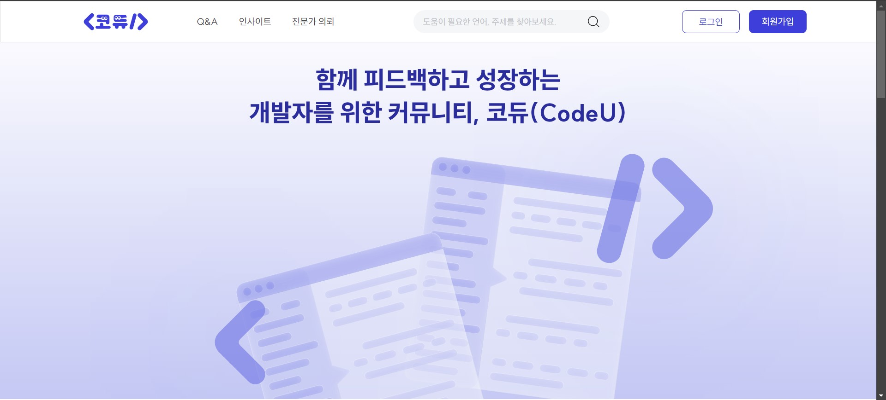

<h3 align="center">
  Welcome to <b>CodeU</b>!
  
</h3>

  

 

    <a href="https://final-project-flame-nu.vercel.app/">
         CodeU 사이트 바로가기
    </a>

    <a href="https://www.notion.so/teamsparta/A08-77087b93ead74831ab62a973c70d3330">
         팀 노션 바로가기
    </a>

    <a href="https://www.figma.com/design/3ycjBsaCimkiAU7mxt8TlI/%ED%8C%94%EC%83%89%EC%A1%B0(A08)?node-id=756-12751&t=247JHFfGARCgYJ45-0">
        피그마 바로가기
    </a>

 

# 목차

👨‍👩‍👧‍👦 [팀원 소개](#팀원-소개)
 
 [프로젝트 개요](#프로젝트-개요)
 
🛠️ [기술 스택](#️-기술-스택)
 
💁‍♂️ [기능 소개](#-기능-소개)
 
📄 [페이지 소개](#-페이지-소개)

 
 

# 👨‍👩‍👧‍👦 팀원 소개

<table>
  <thead>
    <tr>
      <th style="text-align: center;">position</th>
      <th style="text-align: center;">name</th>
      <th style="text-align: center;">GitHub</th>
    </tr>
  </thead>
  <tbody>
    <tr>
      <td>👑 리더</td>
      <td>박민서</td>
      <td><a href="https://github.com/mensung2">https://github.com/mensung2</a></td>
    </tr>
    <tr>
      <td>👑 부리더</td>
      <td>김현진</td>
      <td><a href="https://github.com/hj7321">https://github.com/hj7321</a></td>
    </tr>
    <tr>
      <td>👨 팀원</td>
      <td>김효진</td>
      <td><a href="https://github.com/hyowls">https://github.com/hyowls</a></td>
    </tr>
    <tr>
      <td>👨 팀원</td>
      <td>양동규</td>
      <td><a href="https://github.com/dongkyusq">https://github.com/dongkyusq</a></td>
    </tr>
    <tr>
      <td>👨 팀원</td>
      <td>황승현</td>
      <td><a href="https://github.com/hwangshyun">https://github.com/hwangshyun</a></td>
    </tr>
    <tr>
      <td>🖌️ 디자이너</td>
      <td>한주희</td>
      <td style="text-align: center;">-</td>
    </tr>
  </tbody>
</table>

 
 

#  프로젝트 개요

- 프로젝트명 : **코듀(CodeU)**

- 프로젝트명 의미 : 코드(code)와 듀오(duo)의 결합으로, **함께 성장하는 프로그래머**를 의미합니다.

- 프로젝트 한 줄 소개 : 코딩을 공부하는 모든 사람들을 위한 **실시간 피드백 서비스**와 **커뮤니티 서비스**를 결합한 플랫폼

- 프로젝트 기획 의도

  > 코딩을 하다가 막히는 부분이 생기면 대부분 구글링을 통해 해결책을 찾게 됩니다.  
  > 하지만 구글링 결과 중 상당수가 영어로 된 사이트이기 때문에, 한국인 입장에서는 정보를 찾고 이해하는 데 어려움이 있습니다.  
  > 이러한 문제를 해결하기 위해, 저희늰 **한국어로 쉽게 접근할 수 있는 서비스를 출시**하여 **한국 개발자들이 코딩 공부를 더 수월하게 할 수 있도록** 돕고자 합니다.

- 프로젝트 목표

  1. **개발자 커뮤니티 형성 및 활성화**

     > - 서로의 경험과 지식을 자유롭게 공유하고, 서로 배우며 성장할 수 있는 플랫폼을 구축합니다.
     > - 초보 개발자부터 숙련된 전문가까지 다양한 수준의 개발자들이 활발하게 참여하고 기여할 수 있는 커뮤니티를 형성합니다.

  

  2. **효율적인 문제 해결 지원**

     > - 코딩 과정에서 겪는 다양한 문제를 빠르고 효과적으로 해결할 수 있도록 도와주는 서비스를 제공합니다.
     > - 신속한 질문 응답, 전문가의 코드 리뷰, 실시간 피드백 등 다양한 문제 해결 방법을 통해 개발자들의 생산성을 극대화합니다.

  

  3. **지식 공유 및 기술 역량 강화**

     > - 개발자들이 최신 기술 트렌드, 유용한 팁, 문제 해결 사례 등을 공유하여 커뮤니티 전체의 기술 역량을 높입니다.
     > - 체계적인 지식 관리와 접근성을 통해 커뮤니티 구성원들이 쉽게 정보를 찾고 활용할 수 있도록 합니다.

  

  4. **전문가와의 연결 및 협력 강화**

     > - 초보 개발자들이 전문가와 직접 소통하고 조언을 받을 수 있는 기회를 제공하여, 멘토링과 역량 강화를 지원합니다.
     > - 전문가들은 자신의 경험과 지식을 공유함으로써 커뮤니티에 기여하고, 동시에 자신의 전문성을 더욱 발전시킬 수 있습니다.

  

  5. **개발 문화 및 협업 환경 개선**

     > - 건강한 개발 문화를 형성하고, 협업을 통해 더 나은 결과물을 만들어낼 수 있도록 지원합니다.
     > - 피드백을 주고받는 과정을 통해 구성원들 간의 신뢰와 협력을 강화하고, 긍정적인 커뮤니티 문화를 조성합니다.

   

- 프로젝트 주요 서비스

  1. **질의응답 서비스** (커뮤니티 - Q&A 게시판)

     > 🌟 Q&A 게시판에 **코딩 및 IT 관련 문제와 관련된 질문**을 쉽게 올리고,  
     > 커뮤니티의 도움을 받아 **신속하고 정확한 답변**을 얻을 수 있는 서비스입니다.
     >
     > - 커뮤니티 구성원들 간의 지식 공유를 촉진합니다.
     > - 초보 개발자들에게 신속한 문제 해결 방법을 제공합니다.
     > - 특정 문제에 대한 다양한 해결책을 제시하여 사용자들이 여러 관점에서 문제를 이해할 수 있도록 돕습니다.

  

  2. **지식 공유 서비스** (커뮤니티 - 인사이트 게시판)

     > 🌟 인사이트 게시판에서 자신이 경험한 **문제 해결 과정**이나 **유용한 팁, 트릭, 기술 트렌드** 등을 공유할 수 있는 서비스입니다.
     >
     > - 개발자 커뮤니티 내의 정보와 경험 공유를 촉진합니다.
     > - 최신 기술 트렌드와 베스트 프랙티스를 공유함으로써 개발자들의 기술 수준을 향상시킵니다.
     > - 실질적인 사례를 통해 사용자들이 실제 문제 해결에 필요한 통찰력을 획득할 수 있도록 돕습니다.

  

  3. **코드 리뷰 서비스** (전문가 의뢰 게시판)

     > 🌟 전문가 의뢰 게시판에서 **자신의 코드를 전문가에게 검토**받아 코드의 품질을 높이고, 최적화된 코드 작성을 유도하는 서비스입니다.
     >
     > - 코드의 품질을 높이고 버그를 사전에 예방합니다.
     > - 최적화된 코드 작성 방법을 배우는 기회를 제공합니다.
     > - 코드 리뷰를 통해 개발자들의 성장과 역량을 강화합니다.

  

  4. **실시간 피드백 서비스** (실시간 채팅)

     > 🌟 1:1 채팅을 통해 **실시간으로 질문**하고 **즉각적인 피드백**을 받을 수 있는 서비스입니다.
     >
     > - 빠른 문제 해결을 통해 개발자들의 생산성을 향상시킵니다.
     > - 실시간 피드백을 통해 더 현장감 있는 경험을 제공하며, 즉각적인 조정을 통해 최적의 결과를 얻을 수 있습니다.
     > - 사용자 간의 즉각적인 소통과 네트워킹 기회를 제공합니다.

 
 

# 🛠️ 기술 스택

 
 

# 💁‍♂️ 기능 소개

### 1. OAuth 소셜 로그인 기능 🔒

- Kakao , Google , GitHub  계정을 통한 간편 로그인이 가능합니다.
- 이메일이 동일한 경우,

### 2. 채팅 기능 💬

### 3. 검색 기능 🔍

### 4. 페이지네이션 🔢

- Q&A 페이지, Insight 페이지에서 사용되었습니다.

### 5. 무한 스크롤 ♾️

- 전문가 의뢰 페이지에서 사용되었습니다.
-

 
 

# 📄 페이지 소개

### 1. 메인 페이지 (홈페이지)

  
미리보기

  

  
메인 페이지로 이동하는 방법

      <blockquote style="margin-left: 35px; margin-bottom: 20px">
      ✅ 공통 헤더의 로고를 클릭합니다.
       
      ✅ <b>로그인 상태</b>에서, 공통 헤더의 "로그아웃" 버튼을 클릭합니다.
      </blockquote>

- **화면을 100% 채우는 큰 이미지**가 있고, 스크롤을 내리면 메인 내용이 나옵니다.
- 메인 내용에는 **언어별 카테고리**, **커뮤니티 섹션**, **전문가 의뢰 섹션**이 있습니다.

  - 
<strong>언어별 카테고리</strong>

      <blockquote>
      <ul>
         <li>특정 언어 아이콘을 클릭하면 ➡️ <strong>검색 결과 페이지</strong>로 이동합니다.</li>
      </ul>
      </blockquote>

   

  - 
<strong>커뮤니티 섹션</strong>

     <blockquote>
     <ul>
        <li>인기글과 최신글 일부가 나옵니다.</li>
        <li>Q&A 섹션 상단 오른쪽의 작은 "더보기" 링크를 클릭하면 ➡️ <strong>Q&A 페이지</strong>로 이동합니다.</li>
        <li>Insight 섹션 상단 오른쪽의 작은 "더보기" 링크를 클릭하면 ➡️ <strong>Insight 페이지</strong>로 이동합니다.</li>
     </ul>
     </blockquote>

   

  - 
<strong>전문가 의뢰 섹션</strong>

     <blockquote>
     <ul>
        <li>최신순으로 전문가 의뢰 글 8개가 나옵니다.</li>
        <li>전문가 의뢰 섹션 상단 오른쪽의 작은 "더보기" 링크를 클릭하면 ➡️ <strong>전문가 의뢰 페이지</strong>로 이동합니다.</li>
     </ul>
     </blockquote>

### 2. 회원가입 페이지

  
미리보기 (사진 수정해야 함)

  

  
회원가입 페이지로 이동하는 방법

      <blockquote style="margin-left: 35px; margin-bottom: 20px">
      ✅ <b>비로그인 상태</b>에서, 공통 헤더의 "회원가입" 버튼을 클릭합니다.
       
      ✅ <b>비로그인 상태</b>에서, 로그인 페이지의 "회원가입 하기" 링크를 클릭합니다.
      </blockquote>

### 3. 로그인 페이지

  
미리보기 (사진 수정해야 함)

  

  
로그인 페이지로 이동하는 방법

      <blockquote style="margin-left: 35px; margin-bottom: 20px">
      ✅ <b>비로그인 상태</b>에서, 공통 헤더의 "로그인" 버튼을 클릭합니다.
       
      ✅ <b>비로그인 상태</b>에서, 비밀번호 찾기 페이지의 "로그인 하기" 링크를 클릭합니다.
       
      ✅ <b>비로그인 상태</b>에서, Q&A 페이지의 "질문 남기기" 버튼을 클릭합니다.
       
      ✅ <b>비로그인 상태</b>에서, Insight 페이지의 "지식 공유하기" 버튼을 클릭합니다.
       
      ✅ <b>비로그인 상태</b>에서, Q&A 페이지 또는 Insight 페이지에서 댓글 textarea를 클릭합니다.
       
      ✅ <b>비로그인 상태</b>에서, 전문가 의뢰 상세 페이지에서 "문의하기" 또는 "결제하기" 버튼을 클릭합니다.
      </blockquote>

### 4. Q&A 페이지

  
미리보기 (사진 수정해야 함)

  

  
Q&A 페이지로 이동하는 방법

      <blockquote style="margin-left: 35px; margin-bottom: 20px">
      ✅ 공통 헤더의 "Q&A" 카테고리를 클릭합니다.
       
      ✅ 홈페이지의 커뮤니티 섹션 내의 Q&A 섹션 상단 오른쪽의 작은 "더보기" 링크를 클릭합니다.
      </blockquote>

### 5. Insight 페이지

  
미리보기 (사진 수정해야 함)

  

  
Insight 페이지로 이동하는 방법

      <blockquote style="margin-left: 35px; margin-bottom: 20px">
      ✅ 공통 헤더의 "Insight" 카테고리를 클릭합니다.
       
      ✅ 홈페이지의 커뮤니티 섹션 내의 Insight 섹션 상단 오른쪽의 작은 "더보기" 링크를 클릭합니다.
      </blockquote>

### 6. 전문가 의뢰 페이지

  
미리보기 (사진 수정해야 함)

  

  
전문가 의뢰 페이지로 이동하는 방법

      <blockquote style="margin-left: 35px; margin-bottom: 20px">
      ✅ 공통 헤더의 "전문가 의뢰" 카테고리를 클릭합니다.
       
      ✅ 홈페이지의 전문가 의뢰 섹션 상단 오른쪽의 작은 "더보기" 링크를 클릭합니다.
      </blockquote>

### 7. 마이페이지

  
미리보기 (사진 수정해야 함)

  

  
마이페이지로 이동하는 방법

      <blockquote style="margin-left: 35px; margin-bottom: 20px">
      ✅ <b>로그인 상태</b>에서, 공통 헤더에 있는 닉네임을 클릭합니다.
      </blockquote>

