<h3 align="center">
  Welcome to <b>CodeU</b>!
  
</h3>
<p align="center">
  <a href="https://github.com/CodeWhiteWeb/CodeWhiteWeb"></a>
</p>

<hr>
<br>
<p style="font-size: 1.5em; font-weight: bold;">
    <a href="https://final-project-flame-nu.vercel.app/">
         CodeU 사이트 바로가기
    </a>
</p>
<p style="font-size: 1.5em; font-weight: bold;">
    <a href="https://www.notion.so/teamsparta/A08-77087b93ead74831ab62a973c70d3330">
         팀 노션 바로가기
    </a>
</p>
<p style="font-size: 1.5em; font-weight: bold;">
    <a href="https://www.figma.com/design/3ycjBsaCimkiAU7mxt8TlI/%ED%8C%94%EC%83%89%EC%A1%B0(A08)?node-id=756-12751&t=247JHFfGARCgYJ45-0">
         피그마 바로가기
    </a>
</p>

<br>

# 목차

👨‍👩‍👧‍👦 [팀원 소개](#팀원-소개)
<br>
 [프로젝트 개요](#프로젝트-개요)
<br>
🛠️ [기술 스택](#️-기술-스택)
<br>
💁‍♂️ [기능 소개](#-기능-소개)
<br>
📄 [페이지 소개](#-페이지-소개)
<br>
📋 [ERD Diagram](#-erd-diagram)
<br>
🗂️ [파일 구조](#️-파일-구조)
<br>
🚨 [트러블 슈팅](#-트러블-슈팅)

<br>

# 👨‍👩‍👧‍👦 팀원 소개

<table>
  <thead>
    <tr>
      <th style="text-align: center;">position</th>
      <th style="text-align: center;">name</th>
      <th style="text-align: center;">GitHub</th>
    </tr>
  </thead>
  <tbody>
    <tr>
      <td>👑 리더</td>
      <td>박민서</td>
      <td><a href="https://github.com/mensung2">https://github.com/mensung2</a></td>
    </tr>
    <tr>
      <td>👑 부리더</td>
      <td>김현진</td>
      <td><a href="https://github.com/hj7321">https://github.com/hj7321</a></td>
    </tr>
    <tr>
      <td>👨 팀원</td>
      <td>김효진</td>
      <td><a href="https://github.com/hyowls">https://github.com/hyowls</a></td>
    </tr>
    <tr>
      <td>👨 팀원</td>
      <td>양동규</td>
      <td><a href="https://github.com/dongkyusq">https://github.com/dongkyusq</a></td>
    </tr>
    <tr>
      <td>👨 팀원</td>
      <td>황승현</td>
      <td><a href="https://github.com/hwangshyun">https://github.com/hwangshyun</a></td>
    </tr>
    <tr>
      <td>🖌️ 디자이너</td>
      <td>한주희</td>
      <td style="text-align: center;">-</td>
    </tr>
  </tbody>
</table>

<br>
<br>

#  프로젝트 개요

- 프로젝트명 : **코듀(CodeU)**

- 프로젝트명 의미 : 코드(code)와 듀오(duo)의 결합으로, **함께 성장하는 프로그래머**를 의미합니다.

- 프로젝트 한 줄 소개 : 코딩을 공부하는 모든 사람들을 위한 **실시간 피드백 서비스**와 **커뮤니티 서비스**를 결합한 플랫폼

- 프로젝트 기획 의도

  > 코딩을 하다가 막히는 부분이 생기면 대부분 구글링을 통해 해결책을 찾게 됩니다.  
  > 하지만 구글링 결과 중 상당수가 영어로 된 사이트이기 때문에, 한국인 입장에서는 정보를 찾고 이해하는 데 어려움이 있습니다.  
  > 이러한 문제를 해결하기 위해, 저희는 **한국어로 쉽게 접근할 수 있는 서비스를 출시**하여 **한국 개발자들이 코딩 공부를 더 수월하게 할 수 있도록** 돕고자 합니다.

- 프로젝트 목표

  1. **개발자 커뮤니티 형성 및 활성화**

     > - 서로의 경험과 지식을 자유롭게 공유하고, 서로 배우며 성장할 수 있는 플랫폼을 구축합니다.
     > - 초보 개발자부터 숙련된 전문가까지 다양한 수준의 개발자들이 활발하게 참여하고 기여할 수 있는 커뮤니티를 형성합니다.

  <p style="margin-bottom: 20px;"></p>

  2. **효율적인 문제 해결 지원**

     > - 코딩 과정에서 겪는 다양한 문제를 빠르고 효과적으로 해결할 수 있도록 도와주는 서비스를 제공합니다.
     > - 신속한 질문 응답, 전문가의 코드 리뷰, 실시간 피드백 등 다양한 문제 해결 방법을 통해 개발자들의 생산성을 극대화합니다.

  <p style="margin-bottom: 20px;"></p>

  3. **지식 공유 및 기술 역량 강화**

     > - 개발자들이 최신 기술 트렌드, 유용한 팁, 문제 해결 사례 등을 공유하여 커뮤니티 전체의 기술 역량을 높입니다.
     > - 체계적인 지식 관리와 접근성을 통해 커뮤니티 구성원들이 쉽게 정보를 찾고 활용할 수 있도록 합니다.

  <p style="margin-bottom: 20px;"></p>

  4. **전문가와의 연결 및 협력 강화**

     > - 초보 개발자들이 전문가와 직접 소통하고 조언을 받을 수 있는 기회를 제공하여, 멘토링과 역량 강화를 지원합니다.
     > - 전문가들은 자신의 경험과 지식을 공유함으로써 커뮤니티에 기여하고, 동시에 자신의 전문성을 더욱 발전시킬 수 있습니다.

  <p style="margin-bottom: 20px;"></p>

  5. **개발 문화 및 협업 환경 개선**

     > - 건강한 개발 문화를 형성하고, 협업을 통해 더 나은 결과물을 만들어낼 수 있도록 지원합니다.
     > - 피드백을 주고받는 과정을 통해 구성원들 간의 신뢰와 협력을 강화하고, 긍정적인 커뮤니티 문화를 조성합니다.

  <br>

- 프로젝트 주요 서비스

  1. **질의응답 서비스** (커뮤니티 - Q&A 게시판)

     > 🌟 Q&A 게시판에 **코딩 및 IT 관련 문제와 관련된 질문**을 쉽게 올리고,  
     > 커뮤니티의 도움을 받아 **신속하고 정확한 답변**을 얻을 수 있는 서비스입니다.
     >
     > - 커뮤니티 구성원들 간의 지식 공유를 촉진합니다.
     > - 초보 개발자들에게 신속한 문제 해결 방법을 제공합니다.
     > - 특정 문제에 대한 다양한 해결책을 제시하여 사용자들이 여러 관점에서 문제를 이해할 수 있도록 돕습니다.

  <p style="margin-bottom: 20px;"></p>

  2. **지식 공유 서비스** (커뮤니티 - 인사이트 게시판)

     > 🌟 인사이트 게시판에서 자신이 경험한 **문제 해결 과정**이나 **유용한 팁, 트릭, 기술 트렌드** 등을 공유할 수 있는 서비스입니다.
     >
     > - 개발자 커뮤니티 내의 정보와 경험 공유를 촉진합니다.
     > - 최신 기술 트렌드와 베스트 프랙티스를 공유함으로써 개발자들의 기술 수준을 향상시킵니다.
     > - 실질적인 사례를 통해 사용자들이 실제 문제 해결에 필요한 통찰력을 획득할 수 있도록 돕습니다.

  <p style="margin-bottom: 20px;"></p>

  3. **코드 리뷰 서비스** (전문가 의뢰 게시판)

     > 🌟 전문가 의뢰 게시판에서 **자신의 코드를 전문가에게 검토**받아 코드의 품질을 높이고, 최적화된 코드 작성을 유도하는 서비스입니다.
     >
     > - 코드의 품질을 높이고 버그를 사전에 예방합니다.
     > - 최적화된 코드 작성 방법을 배우는 기회를 제공합니다.
     > - 코드 리뷰를 통해 개발자들의 성장과 역량을 강화합니다.

  <p style="margin-bottom: 20px;"></p>

  4. **실시간 피드백 서비스** (실시간 채팅)

     > 🌟 1:1 채팅을 통해 **실시간으로 질문**하고 **즉각적인 피드백**을 받을 수 있는 서비스입니다.
     >
     > - 빠른 문제 해결을 통해 개발자들의 생산성을 향상시킵니다.
     > - 실시간 피드백을 통해 더 현장감 있는 경험을 제공하며, 즉각적인 조정을 통해 최적의 결과를 얻을 수 있습니다.
     > - 사용자 간의 즉각적인 소통과 네트워킹 기회를 제공합니다.

<br>
<br>

# 🛠️ 기술 스택

<div style="display: flex gap: 5px">


</div>


<br>
<br>

# 💁‍♂️ 기능 소개

### 1. OAuth 소셜 로그인 기능 🔒

- **Kakao** , **Google** , **GitHub**  계정을 통한 간편 로그인이 가능합니다. 이를 통해 사용자는 **별도의 회원 가입 절차 없이** 이미 사용 중인 소셜 계정을 활용하여 신속하게 로그인할 수 있습니다.

- 소셜 로그인 절차를 통해 받은 회원 정보를 기반으로, **Supabase Authentication 테이블**에 **이메일, 닉네임, 이름, 프로필 사진**을 적절하게 저장합니다. 이 과정은 사용자가 로그인 후 추가로 회원 정보를 재입력할 필요 없이, 소셜 계정에서 직접 가져온 정보를 바탕으로 자동으로 이루어집니다. 이렇게 함으로써 사용자는 편리하게 정보를 관리하고, 로그인 후에도 일관된 사용자 정보를 손쉽게 유지할 수 있습니다.

- 사용자의 이메일 주소를 바탕으로 사용자 계정을 식별하기 때문에, **이메일이 동일한 경우, 같은 사용자로 판단**합니다. 따라서 동일한 이메일을 사용하는 계정으로 소셜 로그인을 하면, 사용자 유형을 묻는 페이지는 나타나지 않고 바로 기존 사용자로 로그인 처리됩니다. 이 방식은 이메일 중복을 자동으로 감지하여 이미 등록된 사용자에게는 반복적인 정보 입력을 요구하지 않고, 새로운 사용자에게만 필요한 정보를 수집함으로써 로그인 절차를 간소화합니다.

<p style="margin-bottom: 30px;"></p>

### 2. 채팅 기능 💬

- **Supabase**의 **Realtime** 기능을 사용하여 **1:1 실시간 채팅** 기능을 구현했습니다.

- 전문가 의뢰 페이지의 **문의하기** 버튼을 클릭하거나, 마이페이지의 **내 채팅 목록** 카테고리에서 특정 채팅 목록을 클릭하면 채팅 모달이 뜨고, 채팅 모달이 뜨면 채팅을 보낼 수 있습니다.

- 사용자는 다른 사용자와 메시지를 **실시간**으로 주고받을 수 있습니다. 서버와의 실시간 연결을 통해 메시지가 즉시 전달되며, 페이지를 새로 고침하지 않고도 대화 내용을 최신 상태로 유지할 수 있습니다.

- 각 채팅은 **1:1 세션**으로 관리되며, 사용자 간의 대화는 개인적인 채널을 통해 이루어집니다. 이를 통해 사용자는 개별 대화의 프라이버시를 보장받으며, 다른 사용자와의 대화와 구분할 수 있습니다.

<p style="margin-bottom: 30px;"></p>

### 3. 검색 기능 🔍

- 헤더의 검색창에 검색어를 입력하거나, 홈페이지의 **언어별 카테고리**에서 특정 언어를 클릭하면 검색 결과 페이지로 이동하여 검색 결과를 조회할 수 있습니다.

- 검색어는 **형광펜으로 강조**한 것처럼 시각적으로 구별되며, 이를 통해 사용자는 검색 결과에서 관심 있는 단어나 구문을 쉽게 식별할 수 있습니다. 이 기능은 검색어가 포함된 부분을 돋보이게 하여, 해당 부분을 더 빠르고 명확하게 찾을 수 있도록 도와줍니다.

- 검색 결과는 **전체**, **Q&A**, **인사이트**, **전문가 의뢰** 총 4개의 탭으로 구분되어 있으며, 각 탭에서의 검색 결과는 **게시물 카드 형태**로 표시됩니다. 이를 통해 사용자는 관련 게시물들을 시각적으로 그룹화된 형태로 쉽게 탐색하고 관리할 수 있습니다.

- 특정 게시물 카드를 클릭하면 해당 게시물의 상세 페이지로 이동합니다.

<p style="margin-bottom: 30px;"></p>

### 4. 페이지네이션 🔢

- **Q&A 페이지**, **인사이트 페이지**에 적용했습니다.

- 각 페이지에는 **최대 7개의 게시물**이 표시됩니다. 이를 통해 사용자에게 한 번에 적절한 양의 정보를 제공하며, 페이지 로딩 속도와 사용자 경험을 최적화합니다.

- 페이지 번호는 **최대 5개까지 표시**되며, 현재 페이지를 기준으로 주변 페이지 번호와 함께 표시됩니다. 이를 통해 사용자는 전체 게시물 목록을 손쉽게 탐색하고, 특정 페이지로의 빠른 이동이 가능합니다.

<p style="margin-bottom: 30px;"></p>

### 5. 무한 스크롤 ♾️

- **전문가 의뢰 페이지**에 적용했습니다.

- 페이지는 **한 번에 10개씩** 데이터를 불러오도록 설정되어 있습니다. 이 방식은 페이지를 빠르게 로드하고 사용자가 스크롤할 때 필요한 만큼의
  데이터를 점진적으로 제공합니다.

- 사용자가 페이지를 스크롤할 때, 스크롤 위치가 페이지 하단에 가까워지면 **자동으로 새로운 데이터를 가져와서** 사용자는 페이지를 넘기거나 새로운 데이터를 찾기 위해 추가 작업을 할 필요가 없습니다.

<p style="margin-bottom: 30px;"></p>

### 6. 결제 기능 💸

- 온라인 결제 처리 및 관련 서비스를 제공하는 통합 결제 플랫폼인 PortOne을 사용하여 결제 기능을 구현했습니다.

- 전문가 의뢰 페이지의 **구매하기** 버튼을 클릭하면 결제 모달이 뜨고, 결제 모달이 뜨면 결제 절차가 진행됩니다. 이 모달에서 사용자는 결제 정보를 입력하고 결제 절차를 진행할 수 있습니다. 결제 모달은 직관적이고 사용하기 쉬운 인터페이스를 제공하여, 결제 과정을 간편하게 완료할 수 있도록 돕습니다.

- 결제 정보가 입력되면 PortOne을 통해 결제가 안전하게 처리되며, 결제 완료 후에는 사용자에게 확인 메시지가 표시됩니다.

<p style="margin-bottom: 30px;"></p>

### 7. 비밀번호 재설정 기능 🔑

- **`supabase.auth.updateUser()`** 메서드를 사용하여 사용자가 비밀번호를 잊어버렸거나 변경이 필요할 때, 비밀번호를 재설정할 수 있는 기능을 제공합니다.

- 로그인 페이지에서 사용자가 비밀번호 재설정 요청을 하면, 이메일을 통해 비밀번호 재설정 링크를 포함한 이메일이 발송됩니다. 이 링크를 통해 사용자는 비밀번호를 새로 설정할 수 있습니다. 사용자는 재설정 링크를 통해 비밀번호를 입력할 수 있는 페이지로 이동하며, 여기서 새로운 비밀번호를 입력합니다.

- 로그인 후에는 마이페이지의 **비밀번호 변경** 카테고리에서 비밀번호를 변경할 수 있습니다. 이 경우에는 재설정 링크 없이 바로 비밀번호 변경이 가능합니다.

<p style="margin-bottom: 30px;"></p>

### 8. 회원 탈퇴 기능 👋

- **`supabase.auth.admin.deleteUser()`** 메서드를 사용하여 사용자가 서비스에서 자신의 계정을 삭제할 수 있는 회원 탈퇴 기능을 제공합니다. 이 기능은 사용자가 서비스를 더 이상 사용하지 않기로 결정했을 때 계정을 안전하게 삭제할 수 있게 합니다.

- 이 메서드는 **Supabase의 관리 권한을 가진 클라이언트**를 통해 호출되며, 관리자가 특정 사용자의 계정을 삭제할 수 있도록 합니다.

- 회원 탈퇴 기능을 안전하게 구현하기 위해 새로운 **서비스 롤 키**를 사용합니다. 이 키는 Supabase의 관리 권한을 가진 클라이언트에서만 사용할 수 있으며, 사용자 계정을 삭제하는 데 필요한 높은 권한을 보장합니다.

<p style="margin-bottom: 30px;"></p>

### 9. 게시물 북마크(찜하기) 기능 🔖

- **Q&A 페이지, 인사이트 페이지, 전문가 의뢰 페이지**에서 게시물 북마크 기능을 제공합니다.

- 북마크한 게시물은 마이페이지의 **찜한 목록** 카테고리에서 조회할 수 있습니다. 마이페이지에서 특정 게시물을 클릭하면 해당 게시물의 상세 페이지로 직접 이동할 수 있어, 사용자가 관심 있는 콘텐츠에 빠르게 접근할 수 있습니다.

- **Optimistic Update**를 통해 사용자 인터페이스의 반응성을 높여, 보다 원활하고 빠른 사용자 경험을 제공합니다.

<p style="margin-bottom: 30px;"></p>

### 10. 댓글 좋아요 기능 ❤️

- **Q&A 페이지, 인사이트 페이지**에서 댓글 좋아요 기능을 제공합니다.

- **Optimistic Update**를 통해 사용자 인터페이스의 반응성을 높여, 보다 원활하고 빠른 사용자 경험을 제공합니다.

<p style="margin-bottom: 30px;"></p>

### 11. 알림 기능 🔔

- **Supabase Realtime**을 활용하여 채팅 데이터베이스의 변경 사항을 실시간으로 감지하여, 사용자가 채팅 메시지를 받을 때 **실시간으로 알림을 제공**합니다.

- 사용자의 채팅방 목록과 각 채팅방의 최신 메시지를 서버에서 가져와 상태를 업데이트합니다. 이 과정에서 각 채팅방의 **최신 메시지, 발신자 정보, 읽지 않은 메시지 수**를 포함한 정보를 관리합니다.

- 사용자가 채팅방을 열면 해당 채팅방의 읽지 않은 메시지 수를 0으로 업데이트하여, 알림 상태를 해제합니다. 이를 통해 사**용자가 직접 확인한 메시지의 읽음 상태를 서버에 반영**합니다.

<br>
<br>

# 📄 페이지 소개

### 1. 메인 페이지 (홈페이지)

<details>
  <summary style="padding-left: 20px; margin-bottom: 10px">미리보기</summary>
  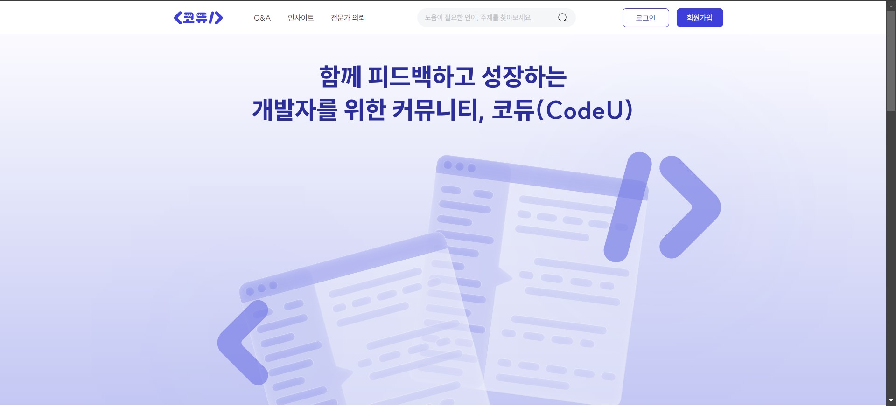
  
  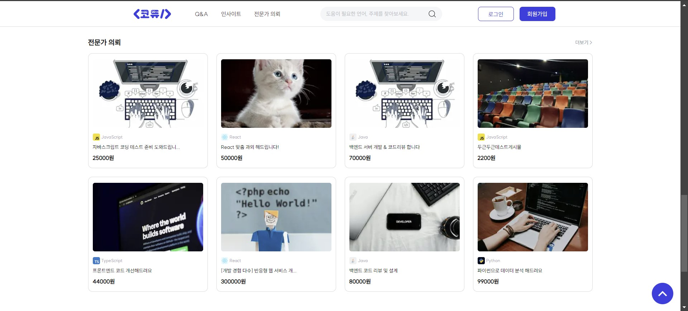
</details>

<details>
  <summary style="padding-left: 20px; margin-bottom: 10px">메인 페이지로 이동하는 방법</summary>
      <blockquote style="margin-left: 35px; margin-bottom: 20px">
      ✅ 공통 헤더의 로고를 클릭합니다.
      <br>
      ✅ <b>로그인 상태</b>에서, 공통 헤더의 "로그아웃" 버튼을 클릭합니다.
      </blockquote>
</details>

- **화면을 100% 채우는 큰 이미지**가 있고, 스크롤을 내리면 메인 내용이 나옵니다.
- 메인 내용에는 **언어별 카테고리**, **커뮤니티 섹션**, **전문가 의뢰 섹션**이 있습니다.

  - <p style="margin-bottom: 7px;"><strong>언어별 카테고리</strong></p>
      <blockquote>
      <ul>
         <li>특정 언어 아이콘을 클릭하면 ➡️ <strong>검색 결과 페이지</strong>로 이동합니다.</li>
      </ul>
      </blockquote>

   <p style="margin-bottom: 20px;"></p>

  - <p style="margin-bottom: 7px;"><strong>커뮤니티 섹션</strong></p>
     <blockquote>
     <ul>
        <li>인기글과 최신글 일부가 나옵니다.</li>
        <li>Q&A 섹션 상단 오른쪽의 작은 "더보기" 링크를 클릭하면 ➡️ <strong>Q&A 페이지</strong>로 이동합니다.</li>
        <li>Insight 섹션 상단 오른쪽의 작은 "더보기" 링크를 클릭하면 ➡️ <strong>Insight 페이지</strong>로 이동합니다.</li>
     </ul>
     </blockquote>

   <p style="margin-bottom: 20px;"></p>

  - <p style="margin-bottom: 7px;"><strong>전문가 의뢰 섹션</strong></p>
     <blockquote>
     <ul>
        <li>최신순으로 전문가 의뢰 글 8개가 나옵니다.</li>
        <li>전문가 의뢰 섹션 상단 오른쪽의 작은 "더보기" 링크를 클릭하면 ➡️ <strong>전문가 의뢰 페이지</strong>로 이동합니다.</li>
     </ul>
     </blockquote>

<p style="margin-bottom: 30px;"></p>

### 2. 회원가입 페이지

<details>
  <summary style="padding-left: 20px; margin-bottom: 10px">미리보기</summary>
  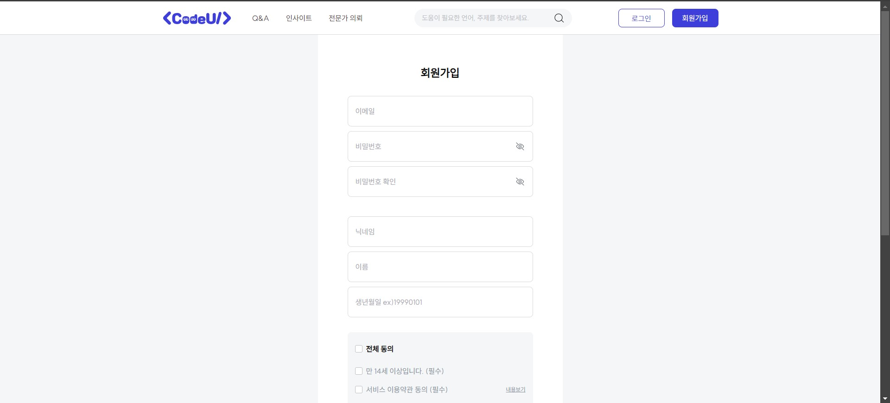
</details>

<details>
  <summary style="padding-left: 20px; margin-bottom: 10px">회원가입 페이지로 이동하는 방법</summary>
      <blockquote style="margin-left: 35px; margin-bottom: 20px">
      ✅ <b>비로그인 상태</b>에서, 공통 헤더의 "회원가입" 버튼을 클릭합니다.
      <br>
      ✅ <b>비로그인 상태</b>에서, 로그인 페이지의 "회원가입 하기" 링크를 클릭합니다.
      </blockquote>
</details>

- 인풋 필드에 내용을 입력할 때마다 **실시간으로 유효성 검사**를 실시하여, 인풋 필드 아래에 **적절한 경고 메시지**를 보여줍니다.

- 경고 메시지가 하나라도 있으면, 회원가입 버튼을 눌러도 회원가입이 되지 않습니다.

- 모든 인풋 필드에 내용을 알맞게 입력한 후에 회원가입 버튼을 누르면, 전문가로 활동할건지, 일반 사용자로 활동할건지를 묻는 사용자 유형 선택 페이지가 나옵니다.

<p style="margin-bottom: 30px;"></p>

### 2-1. 사용자 유형 선택 페이지

<details>
  <summary style="padding-left: 20px; margin-bottom: 10px">미리보기</summary>
  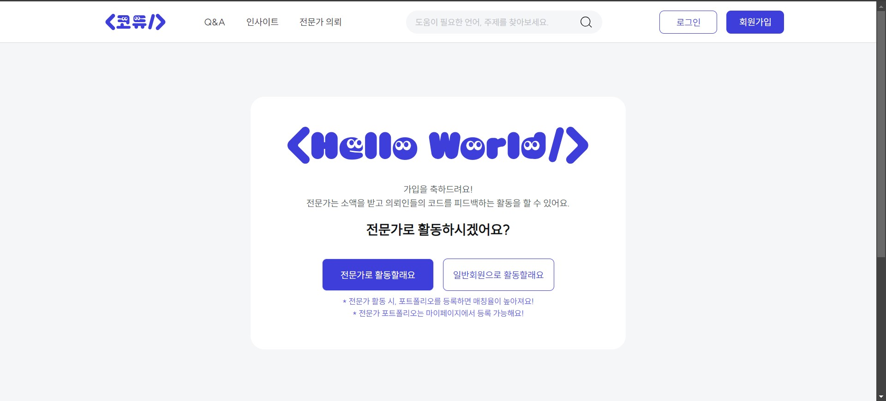
</details>

<p style="margin-bottom: 30px;"></p>

### 3. 로그인 페이지

<details>
  <summary style="padding-left: 20px; margin-bottom: 10px">미리보기</summary>
  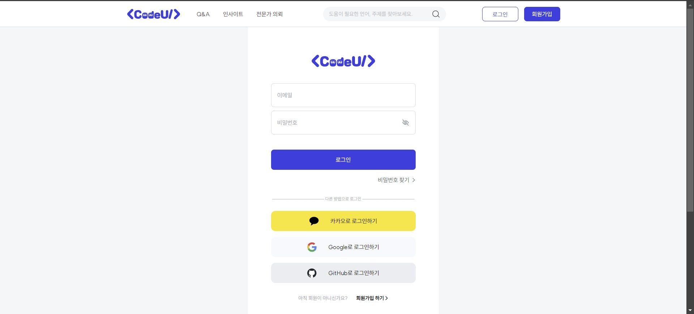
</details>

<details>
  <summary style="padding-left: 20px; margin-bottom: 10px">로그인 페이지로 이동하는 방법</summary>
      <blockquote style="margin-left: 35px; margin-bottom: 20px">
      ✅ <b>비로그인 상태</b>에서, 공통 헤더의 "로그인" 버튼을 클릭합니다.
      <br>
      ✅ <b>비로그인 상태</b>에서, 비밀번호 찾기 페이지의 "로그인 하기" 링크를 클릭합니다.
      <br>
      ✅ <b>비로그인 상태</b>에서, Q&A 페이지의 "질문 남기기" 버튼을 클릭합니다.
      <br>
      ✅ <b>비로그인 상태</b>에서, Insight 페이지의 "지식 공유하기" 버튼을 클릭합니다.
      <br>
      ✅ <b>비로그인 상태</b>에서, Q&A 페이지 또는 Insight 페이지에서 댓글 textarea를 클릭합니다.
      <br>
      ✅ <b>비로그인 상태</b>에서, 전문가 의뢰 상세 페이지에서 "문의하기" 또는 "결제하기" 버튼을 클릭합니다.
      </blockquote>
</details>

- 인풋 필드에 내용을 입력할 때마다 **실시간으로 유효성 검사**를 실시하여, 인풋 필드 아래에 **적절한 경고 메시지**를 보여줍니다.

- 경고 메시지가 하나라도 있으면, 로그인 버튼을 눌러도 로그인이 되지 않습니다.

- "비밀번호 찾기" 텍스트를 클릭하면, 비밀번호 찾기 페이지로 이동합니다.

- 소셜 로그인을 통한 간편 로그인도 가능합니다.

<p style="margin-bottom: 30px;"></p>

### 3-1. 비밀번호 찾기 페이지

<details>
  <summary style="padding-left: 20px; margin-bottom: 10px">미리보기</summary>
  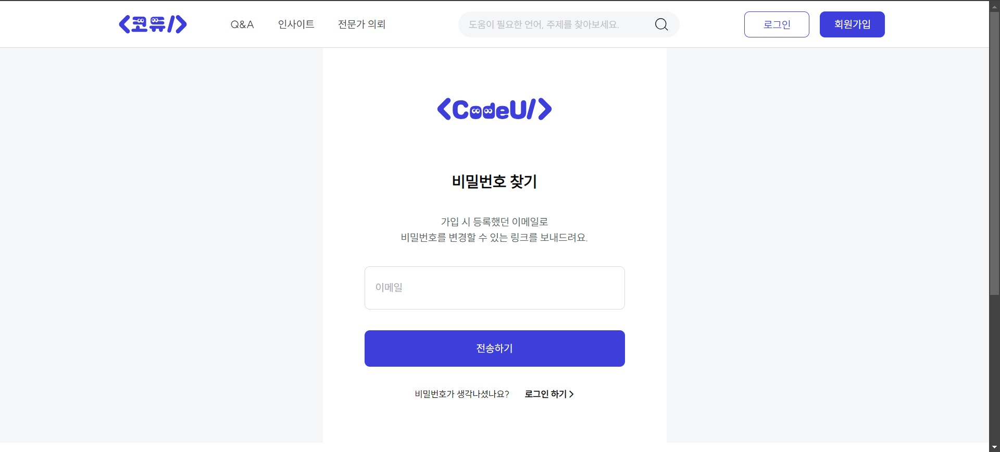
</details>

<p style="margin-bottom: 30px;"></p>

### 3-2. 비밀번호 재설정 페이지

<details>
  <summary style="padding-left: 20px; margin-bottom: 10px">미리보기</summary>
  
</details>

<p style="margin-bottom: 30px;"></p>

### 4. Q&A 페이지

<details>
  <summary style="padding-left: 20px; margin-bottom: 10px">미리보기</summary>
  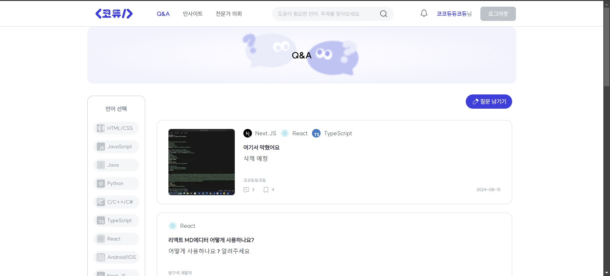
</details>

<details>
  <summary style="padding-left: 20px; margin-bottom: 10px">Q&A 페이지로 이동하는 방법</summary>
      <blockquote style="margin-left: 35px; margin-bottom: 20px">
      ✅ 공통 헤더의 "Q&A" 카테고리를 클릭합니다.
      <br>
      ✅ 홈페이지의 커뮤니티 섹션 내의 Q&A 섹션 상단 오른쪽의 작은 "더보기" 링크를 클릭합니다.
      </blockquote>
</details>

<p style="margin-bottom: 30px;"></p>

### 4-1. Q&A 상세 페이지

<details>
  <summary style="padding-left: 20px; margin-bottom: 10px">미리보기</summary>
  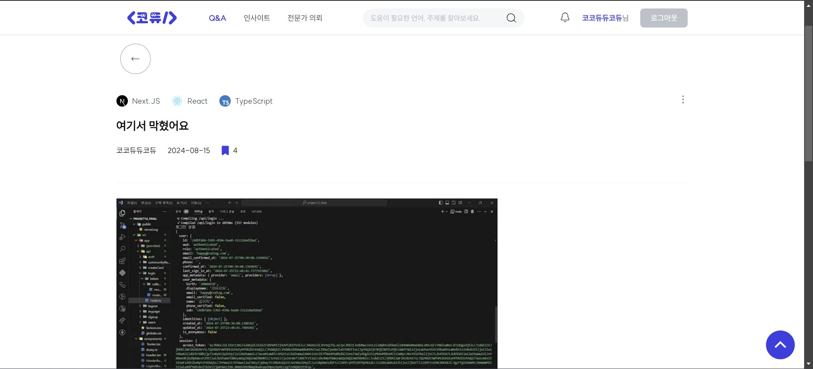
</details>

<p style="margin-bottom: 30px;"></p>

### 5. 인사이트 페이지

<details>
  <summary style="padding-left: 20px; margin-bottom: 10px">미리보기</summary>
  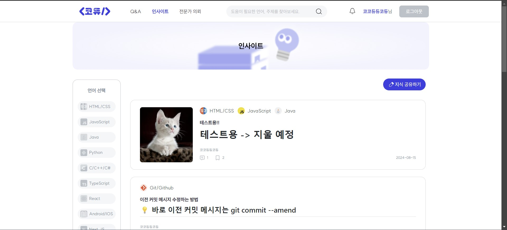
</details>

<details>
  <summary style="padding-left: 20px; margin-bottom: 10px">인사이트 페이지로 이동하는 방법</summary>
      <blockquote style="margin-left: 35px; margin-bottom: 20px">
      ✅ 공통 헤더의 "인사이트" 카테고리를 클릭합니다.
      <br>
      ✅ 홈페이지의 커뮤니티 섹션 내의 인사이트 섹션 상단 오른쪽의 작은 "더보기" 링크를 클릭합니다.
      </blockquote>
</details>

<p style="margin-bottom: 30px;"></p>

### 5-1. 인사이트 상세 페이지

<details>
  <summary style="padding-left: 20px; margin-bottom: 10px">미리보기</summary>
  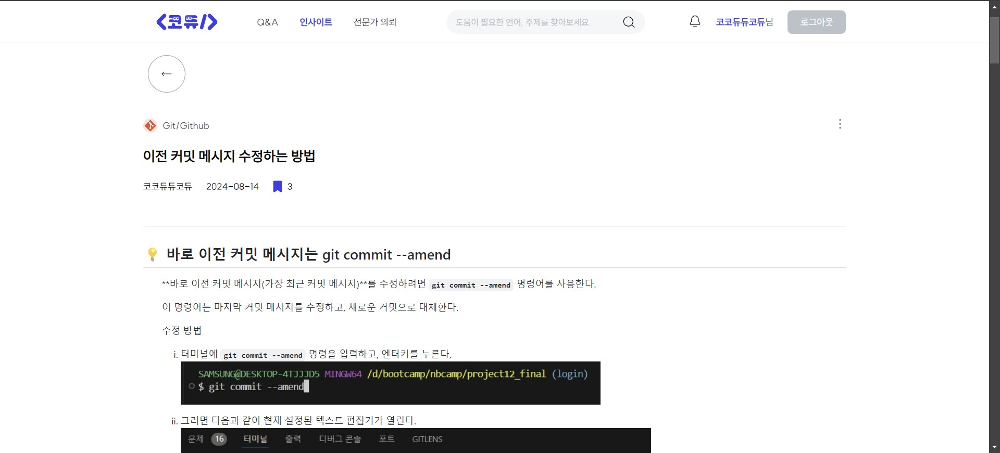
</details>

<p style="margin-bottom: 30px;"></p>

### 6. 전문가 의뢰 페이지

<details>
  <summary style="padding-left: 20px; margin-bottom: 10px">미리보기</summary>
  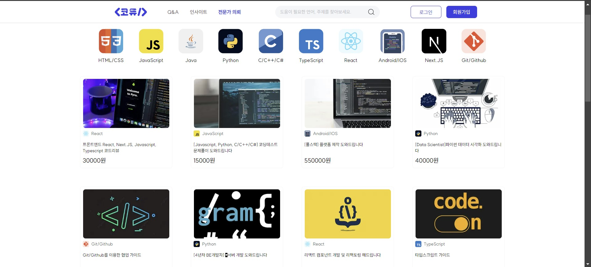
</details>

<details>
  <summary style="padding-left: 20px; margin-bottom: 10px">전문가 의뢰 페이지로 이동하는 방법</summary>
      <blockquote style="margin-left: 35px; margin-bottom: 20px">
      ✅ 공통 헤더의 "전문가 의뢰" 카테고리를 클릭합니다.
      <br>
      ✅ 홈페이지의 전문가 의뢰 섹션 상단 오른쪽의 작은 "더보기" 링크를 클릭합니다.
      </blockquote>
</details>

<p style="margin-bottom: 30px;"></p>

### 6-1. 전문가 의뢰 상세 페이지

<details>
  <summary style="padding-left: 20px; margin-bottom: 10px">미리보기</summary>
  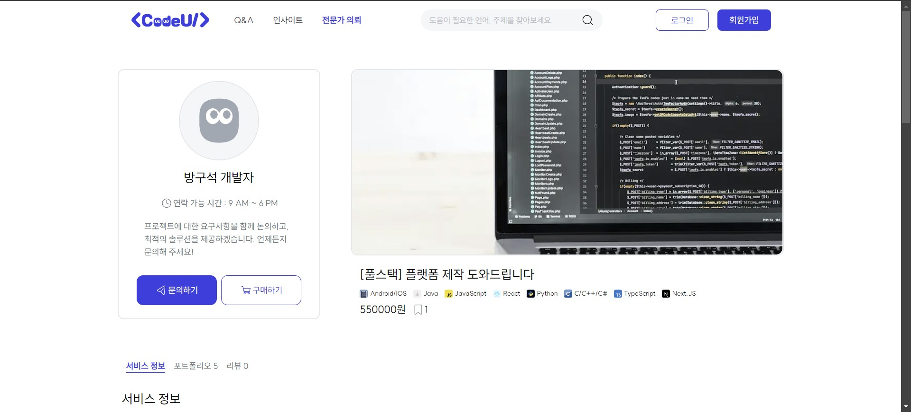
</details>

<p style="margin-bottom: 30px;"></p>

### 7. 마이페이지

<details>
  <summary style="padding-left: 20px; margin-bottom: 10px">미리보기</summary>
  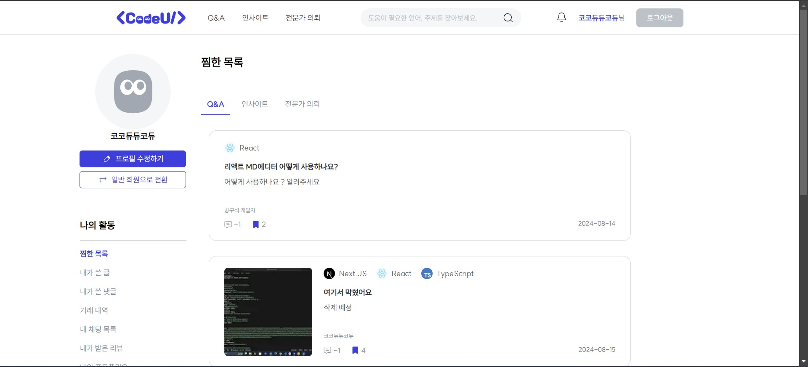
</details>

<details>
  <summary style="padding-left: 20px; margin-bottom: 10px">마이페이지로 이동하는 방법</summary>
      <blockquote style="margin-left: 35px; margin-bottom: 20px">
      ✅ <b>로그인 상태</b>에서, 공통 헤더에 있는 닉네임을 클릭합니다.
      </blockquote>
</details>

### 8. 검색 결과 페이지

<details>
  <summary style="padding-left: 20px; margin-bottom: 10px">미리보기</summary>
  
</details>

<details>
  <summary style="padding-left: 20px; margin-bottom: 10px">검색 페이지로 이동하는 방법</summary>
      <blockquote style="margin-left: 35px; margin-bottom: 20px">
      ✅ 공통 헤더의 검색 인풋 필드에 검색어를 입력한 후 엔터키를 입력하거나, 검색 아이콘을 클릭합니다.
      <br>
      ✅ 홈페이지의 언어 카테고리 중 하나를 클릭합니다.
      </blockquote>
</details>

<br>
<br>

# 📋 ERD Diagram

(사진 첨부 예정)

<br>
<br>

# 🗂️ 파일 구조

```
src ┌─ 📁app
    │     ├─ 📁(provider)
    │     │     ├─ Provider.tsx
    │     │     └─ 📁(root)
    │     │           ├─ layout.tsx
    │     │           ├─ 📄page.tsx
    │     │           ├─ not-found.tsx
    │     │           ├─ 📁signup
    │     │           │     ├─ 📄page.tsx
    │     │           │     ├─ 📁_components
    │     │           │     │     ├─ SignUpForm.tsx
    │     │           │     │     ├─ Validate.tsx
    │     │           │     │     ├─ SignUpComplete.tsx
    │     │           │     │     ├─ Modal.tsx
    │     │           │     │     ├─ TermsOfService.tsx
    │     │           │     │     ├─ PersonalInfo.tsx
    │     │           │     │     └─ Marketing.tsx
    │     │           │     │
    │     │           │     └─ 📁signUpComplete
    │     │           │           └─ 📄page.tsx
    │     │           │
    │     │           ├─ 📁login
    │     │           │     ├─ 📄page.tsx
    │     │           │     ├─ 📁confirmEmail
    │     │           │     │     └─ 📄page.tsx
    │     │           │     ├─ 📁sendLink
    │     │           │     │     └─ 📄page.tsx
    │     │           │     ├─ 📁resetPassword
    │     │           │     │     └─ 📄page.tsx
    │     │           │     └─ 📁loginError
    │     │           │           └─ 📄page.tsx
    │     │           │
    │     │           ├─ 📁search
    │     │           │     └─ 📄page.tsx
    │     │           │
    │     │           ├─ 📁(community)
    │     │           │     ├─ layout.tsx
    │     │           │     ├─ 📁_components
    │     │           │     │     ├─ CompletePostList.tsx
    │     │           │     │     ├─ CommuPost.tsx
    │     │           │     │     ├─ CommuCommentList.tsx
    │     │           │     │     ├─ CommuComment.tsx
    │     │           │     │     ├─ Comment.tsx
    │     │           │     │     ├─ Languages.tsx
    │     │           │     │     └─ Latest.tsx
    │     │           │     │
    │     │           │     ├─ 📁createPost
    │     │           │     │     └─ 📄page.tsx
    │     │           │     │
    │     │           │     ├─ 📁qna
    │     │           │     │     ├─ 📄page.tsx
    │     │           │     │     └─ 📁[id]
    │     │           │     │           └─ 📄page.tsx
    │     │           │     │
    │     │           │     └─ 📁insight
    │     │           │           ├─ 📄page.tsx
    │     │           │           └─ 📁[id]
    │     │           │                 └─ 📄page.tsx
    │     │           │
    │     │           ├─ 📁pro
    │     │           │     ├─ 📄page.tsx
    │     │           │     ├─ 📁createCard
    │     │           │     │     ├─ 📄page.tsx
    │     │           │     │     └─ 📁_components
    │     │           │     │           ├─ TitleInput.tsx
    │     │           │     │           ├─ DescriptionInput.tsx
    │     │           │     │           ├─ PriceInput.tsx
    │     │           │     │           ├─ LanguageSelect.tsx
    │     │           │     │           ├─ ImageUpload.tsx
    │     │           │     │           └─ SubmitButton.tsx
    │     │           │     │
    │     │           │     ├─ 📁proDetail
    │     │           │     │     ├─ 📄page.tsx
    │     │           │     │     └─ 📁[id]
    │     │           │     │           ├─ 📄page.tsx
    │     │           │     │           └─ 📁_components
    │     │           │     │                 ├─ ProDetailSkeleton.tsx
    │     │           │     │                 ├─ PageBackBtn.tsx
    │     │           │     │                 ├─ InquireBtn.tsx
    │     │           │     │                 ├─ PurchaseBtn.tsx
    │     │           │     │                 ├─ PostImage.tsx
    │     │           │     │                 ├─ PostDescription.tsx
    │     │           │     │                 ├─ AccountDetail.tsx
    │     │           │     │                 ├─ PortfolioModal.tsx
    │     │           │     │                 ├─ Review.tsx
    │     │           │     │                 ├─ ServiceDeskTopView.tsx
    │     │           │     │                 ├─ ServiceMobileView.tsx
    │     │           │     │                 ├─ TabBar.tsx
    │     │           │     │                 ├─ UserDescription.tsx
    │     │           │     │                 ├─ UserPortfolio.tsx
    │     │           │     │                 └─ UserProfile.tsx
    │     │           │     │
    │     │           │     └─ 📁_components
    │     │           │           ├─ PostSkeleton.tsx
    │     │           │           ├─ Categories.tsx
    │     │           │           ├─ DesktopButton.tsx
    │     │           │           ├─ MobileButton.tsx
    │     │           │           └─ ProPosts.tsx
    │     │           │
    │     │           ├─ 📁mypage
    │     │           │     └─ 📁[id]
    │     │           │           ├─ 📄page.tsx
    │     │           │           └─ 📁_components
    │     │           │                 ├─ DumyData.ts
    │     │           │                 ├─ AllMypage.tsx
    │     │           │                 ├─ AccountList.tsx
    │     │           │                 ├─ AddPortFolio.tsx
    │     │           │                 ├─ AddReview.tsx
    │     │           │                 ├─ BookmarkCount.tsx
    │     │           │                 ├─ DesktopPostCard.tsx
    │     │           │                 ├─ MobilePostCard.tsx
    │     │           │                 ├─ RequestPostCard.tsx
    │     │           │                 ├─ DeleteUser.tsx
    │     │           │                 ├─ DetailPortfolio.tsx
    │     │           │                 ├─ DetailReview.tsx
    │     │           │                 ├─ EditPortfolio.tsx
    │     │           │                 ├─ EditProfile.tsx
    │     │           │                 ├─ EditReview.tsx
    │     │           │                 ├─ InsightBookmarkList.tsx
    │     │           │                 ├─ InsightPostList.tsx
    │     │           │                 ├─ MobileAddPortfolio.tsx
    │     │           │                 ├─ MobileDetailPortfolio.tsx
    │     │           │                 ├─ MobileEditPortfolio.tsx
    │     │           │                 ├─ MyBookmarkList.tsx
    │     │           │                 ├─ MyCommentList.tsx
    │     │           │                 ├─ MyPostList.tsx
    │     │           │                 ├─ Portfolio.tsx
    │     │           │                 ├─ QnaBookmarkList.tsx
    │     │           │                 ├─ QnaPostList.tsx
    │     │           │                 ├─ ReceiveReview.tsx
    │     │           │                 ├─ RequestBookmarkList.tsx
    │     │           │                 ├─ RequestPostList.tsx
    │     │           │                 ├─ ResetPassword.tsx
    │     │           │                 ├─ SendReview.tsx
    │     │           │                 └─ StarRating.tsx
    │     │           │
    │     │           ├─ 📁chat
    │     │           │     ├─ 📄page.tsx
    │     │           │     └─ 📁_components
    │     │           │           ├─ ChatList.tsx
    │     │           │           └─ ChatModal.tsx
    │     │           │
    │     │           ├─ 📁completedAccount
    │     │           │     └─ 📁[id]
    │     │           │           └─ 📄page.tsx
    │     │           │
    │     │           ├─ 📁personalInfo
    │     │           │     └─ 📄page.tsx
    │     │           │
    │     │           ├─ 📁serviceInfo
    │     │           │     └─ 📄page.tsx
    │     │           │
    │     │           ├─ 📁resetPassword
    │     │           │     └─ 📄page.tsx
    │     │           │
    │     │           └─ 📁deleteUser
    │     │                 └─ 📄page.tsx
    │     │
    │     ├─ 📁api
    │     │     ├─
    │     ├─ favicon.ico
    │     └─ globals.css
    │
    ├─ 📁components
    │     ├─ 📁desktop
    │     │     ├─ DesktopHeader.tsx
    │     │     ├─ LoginHeader.tsx
    │     │     └─ LogoutHeader.tsx
    │     │
    │     ├─ 📁mobile
    │     │     ├─ MobileHeader.tsx
    │     │     ├─ Sidebar.tsx
    │     │     ├─ SearchBar.tsx
    │     │     ├─ AppInfoSidebar.tsx
    │     │     ├─ DetailInfo.tsx
    │     │     ├─ ResetPasswordInMobile.tsx
    │     │     └─ DeleteUserInMobile.tsx
    │     │
    │     ├─ MainSkeletonLoader.tsx
    │     ├─ ServerHeader.tsx
    │     ├─ header.tsx
    │     ├─ footer.tsx
    │     ├─ TopButton.tsx
    │     ├─ ChatNotification.tsx
    │     └─ dumy.ts
    │
    ├─ 📁css
    │     ├─ carousel.css
    │     ├─ chatMdstyle.css
    │     ├─ commentMdStyle.css
    │     ├─ loader.css
    │     ├─ loader.module.css
    │     ├─ mdStyle.css
    │     └─ proMain.css
    │
    ├─ 📁hooks
    │     ├─ useChatNotification.ts
    │     ├─ useChatRoom.tsx
    │     ├─ useCreateCard.tsx
    │     ├─ useFetchData.ts
    │     ├─ useProfile.ts
    │     ├─ useProMain.tsx
    │     ├─ useResetPassword.ts
    │     ├─ useSearchPosts.ts
    │     └─ useSession.ts
    │
    ├─ 📁types
    │     ├─ supabase.ts
    │     ├─ form.type.ts
    │     └─ type.ts
    │
    ├─ 📁utils
    │     └─📁supabase
    │          ├─ client.ts
    │          ├─ server.ts
    │          └─ middleware.ts
    │
    ├─ 📁zustand
    │     ├─ authStore.ts
    │     ├─ indexStore.ts
    │     └─ sidebarStore.ts
    │
    └─ middleware.ts
```

<br>
<br>

# 🚨 트러블 슈팅

1. 회원가입 페이지에서 조건에 맞는 정보를 입력하고, 체크박스에 체크를 한 후, "회원가입" 버튼을 누르면 "회원가입 성공" 메시지가 터미널에 찍히면서 supabase Authentication의 Users 테이블에는 정보가 들어간다.  
   ⚠️ 이때 **password, nickname, name, birth 정보가 누락**되어서 들어간다.

   > **❓원인**  
   > **password 정보**는 누락된 게 아니라 **`encrypted_password` 부분에 암호화해서 저장**되는 것이었다.  
   > 그리고 **email, password 외의 추가 정보들**(nickname, name, birth)을 **`options` 객체 안의 `data` 객체 안에 안 넣어서** 나머지 정보가 누락된 것이었다.

   > **❗해결 방법**  
   > `supabase.auth.signUp()` 함수를 사용하여 회원 정보를 추가할 때, **email, password 외의 추가 정보들을 options 객체 안의 data 객체 안(`options: { data: { nickname, name, birth } }`)에 넣으니까**, `raw_user_meta_data` 객체 안에 정보가 잘 들어가진다.

<p style="margin-bottom: 30px;"></p>

2. 회원가입을 성공적으로 마치면 Users 테이블에 회원 정보가 들어가야 하는데, ⚠️ **POST 401 (Unauthorized) 에러**가 뜬다.  
   ⚠️ **"Users 테이블에 회원정보 저장 실패: new row violates row-level security policy for table 'Users'"** 라는 메시지가 콘솔에 찍히고 **Users 테이블에 정보가 들어가지 않는다.**

   > **❓원인**  
   > **새 행이 "Users" 테이블에 대한 행 수준 보안 정책을 위반**해서 나는 에러이다.

   > **❗해결 방법**  
   > Users 테이블에 **INSERT 정책**으로 **"Enable insert for authenticated users only(인증된 사용자에 대해서만 삽입 활성화)"** 를 추가하니까 Users 테이블에 회원 정보가 잘 들어가진다.

<p style="margin-bottom: 30px;"></p>

3. 회원가입을 성공적으로 마치면 회원가입 완료 알림 페이지로 이동해야 하는데, ⚠️ **Error: NEXT_REDIRECT 에러**가 뜬다.

   > **❓원인**  
   > Next.js 문서의 `Redirecting` 페이지를 읽어 보니, 리다이렉션을 하는 방법이 여러 가지가 있는데 **`redirect()` 메서드는 서버 컴포넌트, 서버 액션, 라우트 핸들러에서 사용할 수 있다**고 되어 있다. 새로운 사실을 알게 되었다.  
   > (참고 URL: https://nextjs.org/docs/app/building-your-application/routing/redirecting)

   > **❗해결 방법**  
   > **`useRouter` 훅을 사용하여 `replace()` 메서드를 사용**해서 페이지를 바꿔주는 방법으로 해결하였다.

<p style="margin-bottom: 30px;"></p>

4. 한 번 더 회원가입을 하면, ⚠️ **POST 429 (Too Many Requests) 에러**가 뜬다.  
   ⚠️ **"회원가입 실패: Email rate limit exceeded"** 라는 메시지가 콘솔에 찍히고 **supabase Authentication의 Users테이블에 정보가 들어가지 않는다.**

   > **❓원인**  
   > **`Authentication > CONFIGURATION > Providers`의 Email 탭에서 "Confirm email"에 체크가 설정**되어 있어서 그런 것이다.  
   > "Confirm email"이 설정되어 있으면, **사용자는 처음 로그인하기 전에 실제 이메일 주소를 확인**해야 하는 과정을 거쳐야 한다.  
   > 하지만 지금은 **그 과정을 거치지 않은 채 다시 한 번 회원가입을 하려고 하니까 supabase Authentication의 Users 테이블의 `Last Sign In` 항목에 "Waiting for verification.." 상태가 뜨면서 에러가 나는 것**이다.

   > **❗해결 방법**  
   > **`Authentication > CONFIGURATION > Providers`의 Email 탭에서 "Confirm email"항목을 체크 해제**하면 된다.

<p style="margin-bottom: 30px;"></p>

5. `app > api > login > route.ts` 파일에서 POST 라우트 핸들러를 작성하고 나서 회원가입을 다시 시도해보니, ⚠️ **POST 405 (Method Not Allowed) 에러**라는 또 새로운 에러를 발견하였다.

   > **❓원인**  
   > 라우트 핸들러를 작성할 때 **`export default async function POST`**와 같이 **기본(default) 내보내기**로 작성해서 Next.js가 API 라우트 핸들러임을 인식하지 못했기 때문이다.  
   > 이 에러를 통해 **Next.js에서 API 라우트 핸들러는 이름 붙인 내보내기를 통해 특정 HTTP 메서드와 매핑된다**는 사실을 알게 되었다.

   > **❗해결 방법**  
   > `default` 키워드를 빼서 **`export async function POST`(이름 붙인 내보내기)** 로 하니까 405 에러가 없어졌다.

<p style="margin-bottom: 30px;"></p>

6. zustand를 사용하여 `isLogin`(로그인 여부 상태)을 전역 상태로 설정하였다. `isLogin`의 기본값은 `false` 이고, 회원가입을 성공적으로 마치면 로그인이 자동으로 되기 때문에 `isLogin`의 값이 `true`로 바뀌면서 헤더의 버튼도 "마이페이지", "로그아웃"으로 잘 렌더링된다.  
   그런데 여기서 ⚠️ **새로고침을 하면 `isLogin` 상태가 `false`로 바뀌면서 로그아웃**이 된다.

   > **❓원인**  
   > 페이지가 새로 고쳐질 때 로그인 상태를 확인하는 로직이 부족하다. 실제로 **supabase 세션이 유지되고 있는지 확인하지 않고 상태를 업데이트**하고 있어서 페이지를 새로고침하면 `isLogin` 상태가 다시 초기값으로 설정되는 것이다.

   > **❗해결 방법**  
   > 전역 상태를 정의한 `useAuthStore`에서 **`supabase.auth.getSession()` 메서드**를 호출하여 **현재 세션 정보를 가져와서 세션 정보가 있으면 로그인 상태를 `true(!!session)`로 설정**했더니, 새로고침해도 상태가 유지된다.

<p style="margin-bottom: 30px;"></p>

7. 로그인 상태에서 새로고침해도 `isLogin` 상태는 유지되는데, ⚠️ **상태를 불러오는 잠깐동안 버튼이 "로그인", "회원가입"으로 렌더링**됐다가, 상태가 정의되면 다시 정상적으로 "마이페이지", "로그아웃"으로 렌더링된다. 이 현상을 없애고 싶다.

   > **❓원인**  
   > **`isLogin`은 zustand(전역 상태)로 관리**하는데, **초기값이 `false`** 이기 때문에 페이지를 새로고침하면 `isLogin` 상태가 처음에 잠깐 `false`로 초기화되어서 그렇다. **`isLogin` 상태에 따라서 렌더링되는 요소가 결정**되기 때문이다.

   > **❗해결 방법**  
   > ServerHeader라는 **서버 컴포넌트**를 만들고 여기에서 **로그인 상태를 미리 가져온 후, 기존 헤더(클라이언트 컴포넌트)에 전달**하면 된다. 이렇게 하면 클라이언트 컴포넌트가 마운트될 때 초기 데이터가 이미 설정되어 있어 불필요한 상태 변화를 방지할 수 있다.

<p style="margin-bottom: 30px;"></p>

8. 카카오 소셜 로그인을 구현하려고 supabase 문서에 따라 라우트 핸들러를 작성하고 카카오 소셜 로그인 버튼을 누르니, ⚠️ **POST 405 (Method Not Allowed) 에러**가 떴다.  
    또 바로 밑에 ⚠️ **"Uncaught (in promise) SyntaxError: Unexpected end of JSON input"** 라는 에러 메시지가 떴다.

   > **❓원인**  
   > supabase 문서에는 **"서버" 부분에 코드를 작성하라는 걸 나는 "라우트 핸들러"로 코드를 작성**해서..? 솔직히 에러의 정확한 원인은 모르겠다.  
   > (참고 URL: https://supabase.com/docs/guides/auth/social-login/auth-kakao?queryGroups=language&language=js&queryGroups=environment&environment=client)

   > **❗해결 방법**  
   > 라우트 핸들러에서는 도저히 어떻게 하는지 모르겠어서, 그냥 **클라이언트 컴포넌트(로그인 페이지)에서 `supabase.auth.signInWithOAuth()` 메서드를 호출하여 사용**하는 것으로 해결했다.

<p style="margin-bottom: 30px;"></p>

9. 일반 로그인과 소셜 로그인을 했을 때의 `getSession()` 메서드의 리턴 값(정확히 말하면 그 리턴 값 안의 `user_metadata` 객체의 키 값 종류들)이 달라서 Users 테이블에 회원 정보를 넣는 과정을 TypeScript문이 아닌 SQL문으로 작성하기로 했다.  
    (어차피 소셜 로그인은 트리거로 작성해야 public의 Users 테이블에 정보를 넣을 수 있다.)  
    이 과정에서 Authentication 테이블의 유저 정보에 들어가는 `raw_user_meta_data` 의 key 값을 일부 수정했다.  
    따라서 일반 로그인을 진행했을 때, `name` 이라는 key 값으로는 닉네임(nickname) 인풋 필드의 값이, `full_name` 에는 이름(name) 인풋 필드의 값이 들어가도록 설정하였다. (소셜 로그인과의 호환성을 위해)  
    기존의 TypeScript문을 주석 처리하고, SQL문을 실행한 후 회원가입을 진행하니까 ⚠️ **Authentication의 users 테이블에는 회원 정보가 잘 담기는데, public의 Users 테이블에는 회원 정보가 담기지 않는 문제**가 발생했다.

   > **❓원인**  
   > Authentication의 users 테이블에는 회원 정보가 잘 담겼던 이유는, SQL문의 `EXCEPTION` 블록 때문이다.  
   > 트리거 함수가 실행되다가 예외가 발생하면 `EXCEPTION` 블록으로 제어가 이동한다.  
   > **`RETURN NEW;`가 호출되어 `auth.users` 테이블의 새로운 행이 반환**되고, 이로 인해 **예외 발생에도 불구하고 `auth.users` 테이블의 데이터 삽입 작업이 계속 진행**되었기 때문이다.  
   > public의 Users 테이블에 회원 정보가 담기지 않았던 이유는 바로 **`public.Users`** 이 부분 때문이다😂  
   > 어떻게 해결했는지는 해결 방법에서..

   > **❗해결 방법**  
   > 저 supabase SQL Editor에서는 대소문자 구분을 명확하게 안 해서 **테이블명에 띄어쓰기나 대문자가 포함되어 있으면 테이블명을 따옴표로 묶어줘야 한다.**  
   > 그래서 **`public.Users` 부분을 `public."Users"`로 수정**하고 회원가입을 진행해 보니, public의 Users 테이블에 회원 정보가 잘 담겼다.  
   > SQL문 Run 했을 때 에러라고 안 떠서 문제의 원인을 찾는 데 시간이 오래 걸렸다.

<p style="margin-bottom: 30px;"></p>

10. 비밀번호 찾기 페이지에서 회원가입했던 이메일을 입력하고, 그 이메일로 비밀번호 재설정 페이지 링크를 받아서 비밀번호 재설정 페이지로 잘 리다이렉트 되는데, 뒤에 다음과 같은 쿼리가 붙어있다.  
    **`?error=access_denied&error_code=403&error_description=Email+link+is+invalid+or+has+expired#error=access_denied&error_code=403&error_description=Email+link+is+invalid+or+has+expired`**  
    거기에서 변경한 비밀번호를 입력한 후, 변경 완료 버튼을 누르면 ⚠️ **GET https://ivuhyqkdxiwtufnsgxcv.supabase.co/rest/v1/Users?select=*&id=eq.null 400 (Bad Request) 에러**가 뜬다.

    > **❓원인**  
    > 여러 가지 원인이 있다.
    >
    > 1. 회원 탈퇴 시에는 supabase anon key가 아닌 **service role key**를 사용해야 하는데, 이 키를 환경변수에 넣어주지 않았다.
    > 2. 1에 이어서, server.ts 파일에 **회원 탈퇴 전용으로 사용하는 supabase 메서드를 추가**해야 하는데, 추가해주지 않고 그냥 원래 서버에 하나 있던 메서드를 사용했다.
    > 3. 로직도 잘못 짰다. 공식 문서에서는 `supabase.auth.onAuthChange()` 메서드를 사용하라고 해서 나도 이걸 사용해서 `event == "PASSWORD_RECOVERY"`라고 로직을 짰는데, 콘솔을 찍어보니 비밀번호를 재설정해도 **"PASSWORD_RECOVERY" 이벤트가 아닌 다른 이벤트가 찍혔다.**

    > **❗해결 방법**
    >
    > 1. 환경변수 파일에 **service role key**를 넣어주었다.
    > 2. server.ts 파일에 **회원 탈퇴 전용으로 사용하는 supabase 메서드를 추가**했다.
    > 3. **`supabase.auth.onAuthChange()` 메서드를 삭제**하고 로직을 변경하였다.

<p style="margin-bottom: 30px;"></p>
